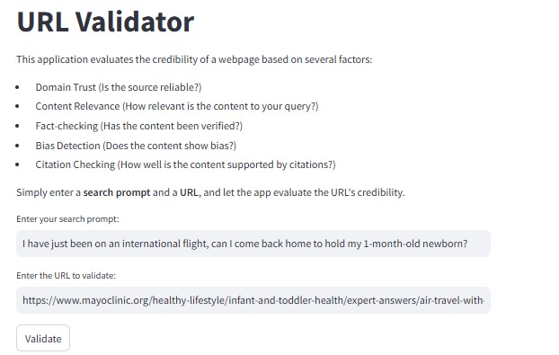
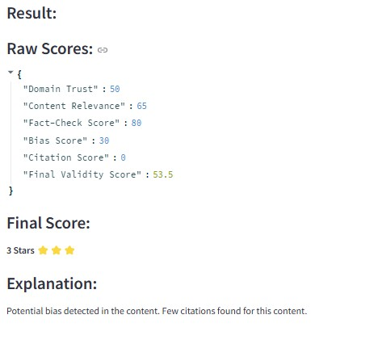

# Andrew Napurano - CS667 Report

## Pace University  
**Project #1 – URL Validator using NLP**  

### **Application Description**
The following **URL Validator** is an **NLP-based machine learning model** that evaluates the **credibility of web links** based on several criteria. This allows users to enhance their own search inquiries by **inputting a question** into the model along with the **associated URL** that originally helped answer their question. The URL may be from **Google search results** or even a **LLM chatbot** such as ChatGPT.  

The application then **returns a weighted score** based on how well that URL answered the question using the following parameters and weightings:

### **Scoring Mechanism**
- **Domain Trust (30%)** → Measures website credibility using **fake news detection**
- **Content Relevance (30%)** → Compares webpage text with user query using **NLP similarity**
- **Fact-Check Score (20%)** → Verifies claims via **fact-checking sites** (Snopes, Politifact, etc.)
- **Bias Score (10%)** → Detects **emotional or political bias** using **sentiment analysis**
- **Citation Score (10%)** → Evaluates **Google Scholar citations** for credibility validation

Additionally, the application provides a **star rating** (1-5 stars) based on the final credibility score, along with an **explanation** of the key factors affecting the rating.

---

## **Streamlit Web Application**
The URL Validator is deployed as a **web-based application using Streamlit**, making it accessible to users via a simple web interface. The application allows users to input a URL, analyze its credibility using NLP models, and receive detailed feedback on the results.

#### **Key Features:**
- **User Input:** Users can enter a URL for evaluation.
- **Content Analysis:** The application extracts webpage content and runs multiple NLP-based assessments.
- **Scoring Mechanism:** The final credibility score is displayed along with detailed explanations.
- **Star Rating:** A 1-5 star rating provides a quick visual summary of the credibility assessment.
- **Real-Time Processing:** The app processes and returns results dynamically.

The Streamlit application is hosted at the following link:  
[**CS667 Capstone Project - URL Validator**](https://cs667-capstone-projects-ivct4umpbiodihfmf5qbo6.streamlit.app/)

#### **User Interface Screenshots:**
Below are images showcasing the Streamlit app's interface and results:

**Main UI Page:**


**Results Display:**


---

## **Data Flow & Processing Pipeline**
To better understand how the application processes data, here is a breakdown of the workflow:
1. **User Input**: The user enters a **search query** and a **URL** to analyze.
2. **Web Scraping**: The app extracts webpage content using **`newspaper3k`**.
3. **NLP Analysis**:
   - **Fake News Detection**: Determines the credibility of the content.
   - **Content Relevance**: Measures how well the content matches the search query.
   - **Fact-Checking**: Compares claims to known fact-checking sources.
   - **Bias Detection**: Assesses sentiment to identify potential bias.
   - **Citation Checking**: Looks for academic citations.
4. **Final Score Calculation**: The scores are weighted and combined into a single credibility score.
5. **Results Display**: The user receives a **star rating, raw scores, and an explanation**.

---

## **Class Object & Implementation**
The application leverages a **`URLValidator` Class**, which serves as the blueprint for organizing and executing all core functionalities of the URL validation process. The **`__init__`** method acts as the URL validator and **loads all AI model dependencies**, reducing redundant API calls and keeping the code well-structured and efficient.

Classes create the **blueprint** for organizing code, allowing different **functions to evaluate URL validity** in a structured way. This modularity makes it easier to update and expand the model.

---

## **Code Documentation & Docstrings**
To help developers and users navigate the functions in the codebase, **docstrings** are used in each class and function. Docstrings provide **multiline documentation** that helps explain what each function does, making it easier for others to read, understand, and modify the code. This is especially useful for maintaining **organized model documentation** and improving collaboration.

Example of a **well-documented function**:
```python
    def fetch_page_content(self, url: str) -> str:
        """Extracts text content from a given webpage URL.
        
        Args:
            url (str): The URL of the webpage to extract content from.
        
        Returns:
            str: The extracted text content (limited to 2000 characters).
        """
```

---

## **Exception Handling & Failing Gracefully**
The application leverages **`try/except`** blocks to allow the code to **fail gracefully** if an error occurs. Instead of stopping execution, errors are logged so developers can track and fix issues efficiently. This also provides users with feedback on where failures happen and ensures that if one part of the validation process fails, the rest of the application continues running.

For example, if an API request fails, instead of breaking the program, we return a **fallback value** and log the error:
```python
try:
    response = requests.get("https://serpapi.com/search", params=params)
    data = response.json()
except Exception as e:
    logging.error(f"Error checking Google Scholar citations: {e}")
    return 0  # Default to no citations if the request fails
```

---

## **Return Statements**
All functions leverage a **return statement** at the end of each code block to **output the appropriate data type** required for each step. For example, in the **scoring mechanism**, since we require **integers and floats** for calculations, we explicitly specify the return type.

Additionally, **exception handling** is integrated into return statements to prevent unexpected crashes.

---

## **Final Score Calculation**
The final credibility score is calculated as follows:

\[ \text{Final Score} = (0.3 \times \text{Domain Trust}) + (0.3 \times \text{Content Relevance}) + (0.2 \times \text{Fact-Check Score}) + (0.1 \times \text{Bias Score}) + (0.1 \times \text{Citation Score}) \]

This score is then converted into a **star rating**, with 5 stars indicating the highest credibility.

---

**End of Report**

